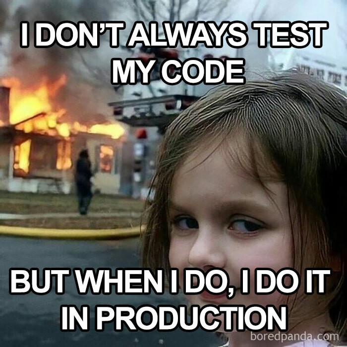
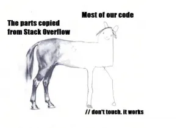

# Pictures

# Styling Text
Hey look that's one hell of a bold **guy**!! And look the second _guy_ is falling!

# Quoting Text
> "Debugging is twice as hard as writing the code in the first place. Therefore, if you write the code as cleverly as possible, you are, by definition, not smart enough to debug it." ~ Brian Kernighan"

# Quoting Code
`if (friends > 0 && faillingClasses == false) { maxSleepHrs = 5; }`

# External Link
[Most recent song I liked](https://music.youtube.com/watch?v=vFYWr25F5cc)

# Section Links
Link back to the Pictures header: [Pictures](#pictures)

# Relative Links
[READMEEEEEEEE](README.md) 

# Unordered List
Top three mangas:
- Naruto
- One Punch Man
- Toriko

# Ordered List
1. Build more projects and join more teams/clubs
2. Get a job
3. Be happy :)
   
# Task List
- [x] Lab 1
- [ ] Lab 2
- [ ] Comprehension Quiz 1